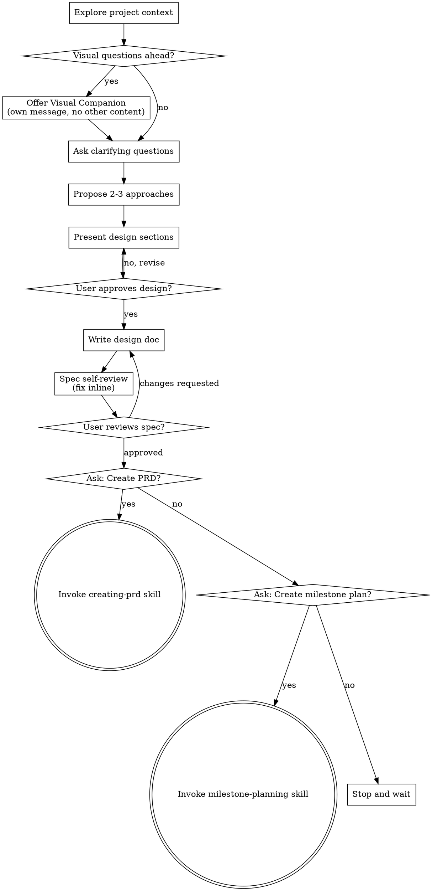
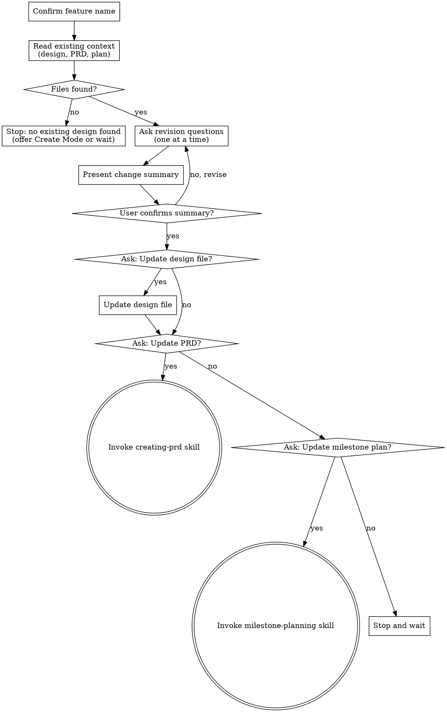

# Brainstorming Ideas Into Designs

Help turn ideas into fully formed designs and specs through natural collaborative dialogue.

Start by understanding the current project context, then ask questions one at a time to refine the idea. Once you understand what you're building, present the design and get user approval.

<HARD-GATE>
Do NOT invoke any implementation skill, write any code, scaffold any project, or take any implementation action until you have presented a design and the user has approved it. This applies to EVERY project regardless of perceived simplicity.
</HARD-GATE>

## Anti-Pattern: "This Is Too Simple To Need A Design"

Every project goes through this process. A todo list, a single-function utility, a config change — all of them. "Simple" projects are where unexamined assumptions cause the most wasted work. The design can be short (a few sentences for truly simple projects), but you MUST present it and get approval.

## Mode Detection

When brainstorming activates, determine which mode applies before asking any questions:

**Revision mode** — any of these apply:
- The user's phrasing includes update/revise/change/modify language directed at an existing feature: "update feature X", "revise the design", "change the plan for Y", "I want to modify the existing design"
- The user references a feature name and any of these files exist at `docs/features/<name>/`: `<name>-design.md`, `prd.md`, or `plan.md`

**Create mode** — none of the above apply and the user is describing something new with no existing design.

**If uncertain**, ask before proceeding:

> "Is this a new feature or an update to an existing one?"

Do not begin either flow's questions until the mode is confirmed.

---

## Checklist (Create Mode)

You MUST create a task for each of these items and complete them in order:

1. **Explore project context** — check files, docs, recent commits
2. **Offer visual companion** (if topic will involve visual questions) — this is its own message, not combined with a clarifying question. See the Visual Companion section below.
3. **Ask clarifying questions** — one at a time, understand purpose/constraints/success criteria
4. **Propose 2-3 approaches** — with trade-offs and your recommendation
5. **Present design** — in sections scaled to their complexity, get user approval after each section
6. **Confirm feature name** — ask the user for the kebab-case feature name; determines the save path for the design doc
7. **Write design doc** — save to `docs/features/<feature-name>/<feature-name>-design.md` and commit
8. **Spec self-review** — quick inline check for placeholders, contradictions, ambiguity, scope (see below)
9. **User reviews written spec** — ask user to review the spec file before proceeding
10. **Transition to next phase** — ask if user wants a PRD (creating-prd), a milestone plan (milestone-planning), or stop

## Process Flow (Create Mode)

For Revision Mode flow, see the **Revision Mode** section below.

**The terminal states are invoking creating-prd, invoking milestone-planning, or stopping to wait.** This applies in both Create Mode and Revision Mode. Do NOT invoke any implementation skill directly.

## The Process

**Understanding the idea:**

- Check out the current project state first (files, docs, recent commits)
- Before asking detailed questions, assess scope: if the request describes multiple independent subsystems (e.g., "build a platform with chat, file storage, billing, and analytics"), flag this immediately. Don't spend questions refining details of a project that needs to be decomposed first.
- If the project is too large for a single spec, help the user decompose into sub-projects: what are the independent pieces, how do they relate, what order should they be built? Then brainstorm the first sub-project through the normal design flow. Each sub-project gets its own spec → plan → implementation cycle.
- For appropriately-scoped projects, ask questions one at a time to refine the idea
- Prefer multiple choice questions when possible, but open-ended is fine too
- Only one question per message - if a topic needs more exploration, break it into multiple questions
- Focus on understanding: purpose, constraints, success criteria

**Exploring approaches:**

- Propose 2-3 different approaches with trade-offs
- Present options conversationally with your recommendation and reasoning
- Lead with your recommended option and explain why

**Presenting the design:**

- Once you believe you understand what you're building, present the design
- Scale each section to its complexity: a few sentences if straightforward, up to 200-300 words if nuanced
- Ask after each section whether it looks right so far
- Cover: architecture, components, data flow, error handling, testing
- Be ready to go back and clarify if something doesn't make sense

**Design for isolation and clarity:**

- Break the system into smaller units that each have one clear purpose, communicate through well-defined interfaces, and can be understood and tested independently
- For each unit, you should be able to answer: what does it do, how do you use it, and what does it depend on?
- Can someone understand what a unit does without reading its internals? Can you change the internals without breaking consumers? If not, the boundaries need work.
- Smaller, well-bounded units are also easier for you to work with - you reason better about code you can hold in context at once, and your edits are more reliable when files are focused. When a file grows large, that's often a signal that it's doing too much.

**Working in existing codebases:**

- Explore the current structure before proposing changes. Follow existing patterns.
- Where existing code has problems that affect the work (e.g., a file that's grown too large, unclear boundaries, tangled responsibilities), include targeted improvements as part of the design - the way a good developer improves code they're working in.
- Don't propose unrelated refactoring. Stay focused on what serves the current goal.

## After the Design

**Documentation:**

Confirm the feature name with the user before writing the design doc. If a name has already been mentioned in the conversation, state it and ask for confirmation rather than re-asking.

> "What's the kebab-case name for this feature? I'll save the design to `docs/features/<name>/<name>-design.md`."

- Write the validated design (spec) to `docs/features/<feature-name>/<feature-name>-design.md`
- Use elements-of-style:writing-clearly-and-concisely skill if available
- Commit the design document to git

**Spec Self-Review:**
After writing the spec document, look at it with fresh eyes:

1. **Placeholder scan:** Any "TBD", "TODO", incomplete sections, or vague requirements? Fix them.
2. **Internal consistency:** Do any sections contradict each other? Does the architecture match the feature descriptions?
3. **Scope check:** Is this focused enough for a single implementation plan, or does it need decomposition?
4. **Ambiguity check:** Could any requirement be interpreted two different ways? If so, pick one and make it explicit.

Fix any issues inline. No need to re-review — just fix and move on.

**User Review Gate:**
After the spec review loop passes, ask the user to review the written spec before proceeding:

> "Spec written and committed to `<path>`. Please review it and let me know if you want to make any changes before we move on."

Wait for the user's response. If they request changes, make them and re-run the spec review loop. Only proceed once the user approves.

**Next Steps:**

After the user approves the spec, ask:

> "Would you like me to create a PRD for this feature?"

- If **yes** — invoke the `creating-prd` skill.
- If **no** — ask: "Would you like me to create an implementation plan with milestones?"
  - If **yes** — invoke the `milestone-planning` skill.
  - If **no** — stop and wait for the user.

Do NOT invoke any implementation skill directly or start writing code.

## Revision Mode

Activates when Mode Detection determines this is an update to an existing feature. This is a focused, delta-only conversation. The original design is the anchor — do not re-run the full discovery questions.

### Checklist (Revision Mode)

You MUST create a task for each of these items and complete them in order:

1. **Confirm feature name** — ask the user to confirm the kebab-case name; it must match `docs/features/<name>/`
2. **Read existing context** — read `<name>-design.md`, `prd.md`, and `plan.md` from `docs/features/<name>/` if they exist. The design file is the primary context anchor; the PRD and plan add additional context. If none of the three files are found, stop and tell the user (see fallback below)
3. **Ask revision questions** — one at a time, conversationally (see questions below)
4. **Present change summary** — summarize the delta clearly; get explicit user confirmation before proceeding
5. **Handoff** — ask about updating the PRD, then the milestone plan; follow the handoff flow below

### Process Flow (Revision Mode)

### Fallback: No Existing Design Found

If Step 2 finds none of the three files at `docs/features/<name>/`, stop the revision flow and tell the user:

> "I don't find any existing design, PRD, or plan at `docs/features/<name>/`. Did you mean to create a new feature? If so, I can switch to Create Mode. If not, check the feature name and try again."

- If the user confirms they want to create a new feature — switch to Create Mode and begin from the top of the Create Mode checklist.
- Otherwise — stop and wait for the user.

### Revision Questions

Ask these one at a time, conversationally. Follow the user's answers — if one answer makes the next question obvious, weave it in naturally.

1. "What specifically are you changing?"
2. "What's motivating the change?"
3. "What stays the same?"
4. "What are the implications?" *(brief — not a deep dive)*

Unlike the Create Mode flow, these four questions are the full conversation. Do not probe further unless an answer is genuinely ambiguous.

### Change Summary

After the four questions, present a clear summary of the delta:

> "Here's what I understand is changing: [summary of what changes, what motivates it, what stays the same, and any implications]"

Wait for explicit user confirmation before proceeding. If the user corrects anything, revise the summary and re-confirm.

### Handoff (Revision Mode)

After the user confirms the summary:

> "Do you want me to update the design file to reflect this change?"

- **Yes** — overwrite `docs/features/<feature-name>/<feature-name>-design.md` with the updated design. Then continue.
- **No** — continue.

> "Do you want to update the PRD to reflect this change?"

- **Yes** — invoke `creating-prd`. It will detect the existing PRD and handle the update.
- **No** — ask: "Do you want to go straight to updating the milestone plan?"
  - **Yes** — invoke `milestone-planning`.
  - **No** — stop and wait.

Do NOT write or modify PRD or plan files from this skill. Do NOT invoke any implementation skill.

---

## Key Principles

- **One question at a time** - Don't overwhelm with multiple questions
- **Multiple choice preferred** - Easier to answer than open-ended when possible
- **YAGNI ruthlessly** - Remove unnecessary features from all designs
- **Explore alternatives** - Always propose 2-3 approaches before settling
- **Incremental validation** - Present design, get approval before moving on
- **Be flexible** - Go back and clarify when something doesn't make sense

## Hard Rules

- **In revision mode, never re-run the full discovery questions.** The original design is the anchor — focus only on the delta.
- **Always confirm the feature name and read existing context (design file, PRD, plan) before discussing the change.** Do not begin revision questions without loading existing context.
- **Never write or modify PRD or plan files from this skill.** Those belong to `creating-prd` and `milestone-planning` respectively. Brainstorming hands off; it does not write PRDs or plans.
- **The design file (`<feature-name>-design.md`) is owned by this skill.** Create Mode writes it. Revision Mode may update it, but only after explicit user confirmation in the handoff step.

---

## Red Flags

| Thought | Reality |
|---|---|
| "The user said 'update feature X' — I'll re-run the full discovery questions to make sure I understand" | NO. Revision mode is focused on the delta, not a full re-derivation. Run the four revision questions only. |
| "I'll just update the PRD myself while I have context — it's faster than handing off" | NO. Brainstorming never writes PRDs or plans. Summarize the change, confirm it, then hand off to `creating-prd`. |
| "The user described the change clearly enough — I don't need to read the existing files first" | NO. Always read the design file, PRD, and plan before the revision conversation. They are the anchor and may contain constraints the user didn't mention. |
| "The change summary is confirmed — I'll update the design file and move straight to offering the PRD" | NO. Always ask explicitly before updating the design file. Confirmation of the summary is not the same as authorization to write. |

---

## Visual Companion

A browser-based companion for showing mockups, diagrams, and visual options during brainstorming. Available as a tool — not a mode. Accepting the companion means it's available for questions that benefit from visual treatment; it does NOT mean every question goes through the browser.

**Offering the companion:** When you anticipate that upcoming questions will involve visual content (mockups, layouts, diagrams), offer it once for consent:
> "Some of what we're working on might be easier to explain if I can show it to you in a web browser. I can put together mockups, diagrams, comparisons, and other visuals as we go. This feature is still new and can be token-intensive. Want to try it? (Requires opening a local URL)"

**This offer MUST be its own message.** Do not combine it with clarifying questions, context summaries, or any other content. The message should contain ONLY the offer above and nothing else. Wait for the user's response before continuing. If they decline, proceed with text-only brainstorming.

**Per-question decision:** Even after the user accepts, decide FOR EACH QUESTION whether to use the browser or the terminal. The test: **would the user understand this better by seeing it than reading it?**

- **Use the browser** for content that IS visual — mockups, wireframes, layout comparisons, architecture diagrams, side-by-side visual designs
- **Use the terminal** for content that is text — requirements questions, conceptual choices, tradeoff lists, A/B/C/D text options, scope decisions

A question about a UI topic is not automatically a visual question. "What does personality mean in this context?" is a conceptual question — use the terminal. "Which wizard layout works better?" is a visual question — use the browser.

If they agree to the companion, read the detailed guide before proceeding:
`skills/brainstorming/visual-companion.md`
