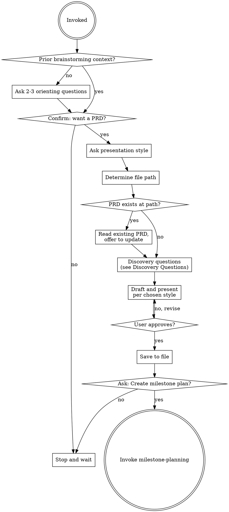

<SUBAGENT-STOP>
If you were dispatched as a subagent to execute a specific task, skip this skill.
</SUBAGENT-STOP>

Turn a brainstorming spec or rough idea into a lightweight Product Requirements Document. The PRD bridges design intent and implementation planning — it exists so future-you (and any collaborators) can understand what was built and why, without reverse-engineering the code.

This skill runs after `brainstorming` approves a spec, or when the user asks directly. It covers discovery, drafting, and handoff to `milestone-planning`. It does not touch implementation.

Discovery questions and the "keep it light" philosophy are adapted from the closedloop-ai prd-creator skill (MIT licensed).

<HARD-GATE>
Do NOT produce a PRD without explicit user confirmation. Do NOT start implementation. This skill ends when the PRD is saved and approved, or when the user declines. No exceptions.
</HARD-GATE>

## Checklist

You MUST create a task for each of these items and complete them in order:

1. **Confirm intent** — run fallback orienting questions first if no prior brainstorming; get explicit yes before any drafting
2. **Ask presentation style** — section-by-section or full draft
3. **Determine file path** — ask if the feature name isn't obvious
4. **Check for existing PRD** — read it if it exists; offer to update, never overwrite
5. **Run discovery questions** — conversationally; flag assumptions as Q-### items
6. **Draft and present per chosen style** — write 15 sections, present for approval
7. **Save to file** — always to repo, never conversation-only
8. **Handoff** — ask about milestone-planning; report gracefully if unavailable

## Process Flow

## The Process

### Fallback: No Prior Brainstorming

If this skill is invoked in a fresh session with no prior brainstorming context, ask 2–3 quick orienting questions before running discovery. The goal is just enough baseline to know what we're talking about — not a full brainstorming session.

Ask one at a time:

1. "What are we building? Give me a one-liner."
2. "What problem does it solve, or what does it enable?"
3. "Is this something new, a change to something existing, or a standalone tool?"

Once you have baseline context, continue to Step 1. If the user's answers suggest the idea needs more exploration before a PRD makes sense, say so and suggest running `brainstorming` first.

### Step 1: Confirm intent

Even when invoked explicitly, confirm before producing anything:

> "I can write a PRD for this. Want me to proceed?"

If the user says no, stop and wait. If yes, continue.

### Step 2: Ask presentation style

> "How would you like to review the PRD as I write it — section by section so we can refine each part, or as a complete first draft you review all at once?"

Hold the answer — it determines how Step 6 runs.

### Step 3: Determine file path

Default path: `docs/features/<kebab-name>/prd.md`

If the feature name isn't obvious from the conversation, ask:

> "What should I call this feature? I'll save the PRD to `docs/features/<name>/prd.md`."

Confirm the path before writing.

### Step 4: Check for existing PRD

Check whether a file already exists at the determined path. If it does:

1. Read it
2. Briefly summarize what it already covers
3. Ask: "A PRD already exists here. Want me to update it with new information, or start fresh?"

Never overwrite silently.

### Step 5: Discovery questions

Run the questions from the **Discovery Questions** section below. Ask them conversationally — one at a time, following the thread of the user's answers.

If brainstorming context already answers a question, skip it or briefly confirm: "I have [X] from the design doc — is that still accurate?" Fill remaining gaps with reasonable assumptions and flag each one as a `Q-###` item for the Open Questions section.

### Step 6: Draft and present per chosen style

Draft the 15 sections per the **PRD Structure** below. Write for a solo developer audience — no jargon. Aim for 2–3 printed pages total; allow longer when the content genuinely requires it.

Then present per the style chosen in Step 2:

- **Section-by-section:** Present each section and wait for the user's thumbs-up before continuing. If they want changes, revise and re-present that section before moving on.
- **Full draft:** Present the complete PRD in one block. Wait for overall approval before saving.

### Step 7: Save to file

Write the approved PRD to the file path from Step 3. Always save to the repo — never leave the PRD as conversation-only output.

### Step 8: Handoff

After saving, ask:

> "Would you like me to create a milestone implementation plan for this feature?"

- **Yes** — invoke `milestone-planning`. If the skill doesn't exist yet, say: "The `milestone-planning` skill isn't available yet — you'll need to create it before I can continue here." Stop there.
- **No** — stop and wait.

---

## Discovery Questions

Ask these conversationally, one at a time. Don't read them as a list. Follow the user's answers — if one answer makes the next question obvious, weave it in naturally.

1. **Problem** — "What's the friction or gap this solves? What breaks down or goes missing without it?"
2. **Evidence** — "What's making this feel real — something you've hit repeatedly, feedback you've received, a hunch that won't go away?"
3. **Why now** — "Why build this now rather than later? What's the cost of not having it — what keeps happening in the meantime?"
4. **Persona** — "Who's the primary user here — you, a specific type of end user, an external API consumer, something else?"
5. **Success** — "What does 'this worked' look like when it's done? What changes, and how would you know?"
6. **First slice** — "What's the smallest version you'd actually use or ship? What can be deferred?"
7. **Risks** — "Any technical constraints, dependencies, security concerns, or integrations that might complicate this?"

Fill gaps with reasonable assumptions. Flag each assumption as a `Q-###` item in the Open Questions section.

---

## PRD Structure

### Part 1 — Business Context

**1. Executive Summary**
2–3 sentences. The 15-second version: what it is, who it's for, why it matters.

**2. Overview**
One paragraph, plain language. What does this feature do?

**3. Background**
Brief context. Why does this exist now? What led here?

**4. Stakeholders**
Bulleted list, no prose. Who is the user, who owns it, who needs to be kept informed.

**5. Business Impact**
Plain-language "so what." What gets better when this ships? Keep this distinct from metrics — this is the narrative, not the numbers.

**6. Goals & Success Metrics**
Measurable outcomes. What specific numbers or behaviors indicate success?

**7. User Stories**
Format: `US-### — As a [user], I want [action] so that [outcome].`

**8. Out of Scope**
Explicit non-goals. What are we deliberately not building?

**9. Sequencing**
Relative ordering only: first, then, finally. No dates, no weeks, no quarters.

---

> The sections below are for the implementation team. Business readers can stop here.

---

### Part 2 — For Implementation Team

**10. Requirements**
Functional and non-functional. Engineer language is fine here.

**11. User Experience**
Key workflows, edge cases, error states.

**12. Technical Considerations**
Dependencies, constraints, architectural notes.

**13. Acceptance Criteria**
Format: `AC-###.# — Given [context], when [action], then [outcome].`
Tie each AC to a US-### ID where applicable.

**14. Open Questions**
Format: `Q-### — [question or flagged assumption]`

**15. Risks & Mitigations**
What could go wrong, and how would you address it?

---

## ID Conventions

| Type | Format | Example |
|---|---|---|
| User Story | US-### | US-001, US-002 |
| Acceptance Criteria | AC-###.# | AC-001.1, AC-001.2 |
| Open Question | Q-### | Q-001, Q-002 |

Acceptance Criteria IDs reference their parent User Story (AC-001.x belongs to US-001).

---

## Keep It Light

- Flag assumptions as `Q-###` items rather than stopping to ask about every gap
- Timelines belong in `milestone-planning`, not here — section 9 uses relative sequencing only
- Any section can be regenerated or expanded later
- A PRD that ships is better than a perfect one that doesn't
- Aim for 2–3 printed pages; go longer only when the content genuinely requires it

---

## Hard Rules

- **Never produce a PRD without explicit user confirmation.** Always ask first.
- **Never start implementation from this skill.** This skill ends at PRD approval and handoff.
- **Never overwrite an existing PRD silently.** Read it first. Offer to update.
- **Always save to file in the repo.** Never leave the PRD as conversation-only output.
- **The visual divider between Part 1 and Part 2 is mandatory.** It must appear in every PRD.

---

## Red Flags

| Thought | Reality |
|---|---|
| "I'll just draft a quick PRD to get things moving" | Never produce a PRD without explicit user confirmation. Ask first, always. |
| "The PRD is done, I can start on the implementation now" | This skill stops at PRD approval. Never start implementation. Invoke `milestone-planning` or stop. |
| "I'll update the PRD with these new requirements" | Read the existing file first. Never silently overwrite. Offer an update and wait for confirmation. |
