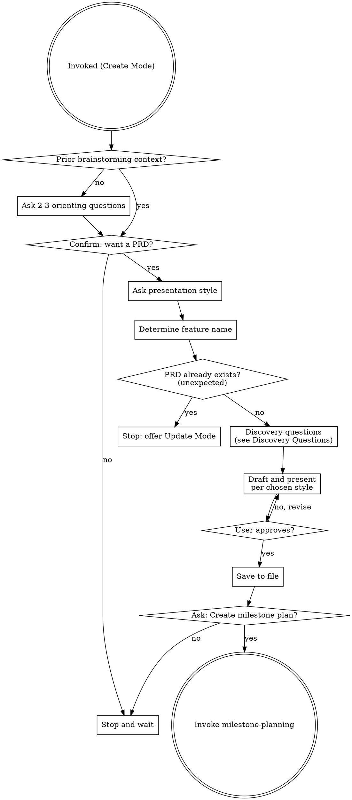
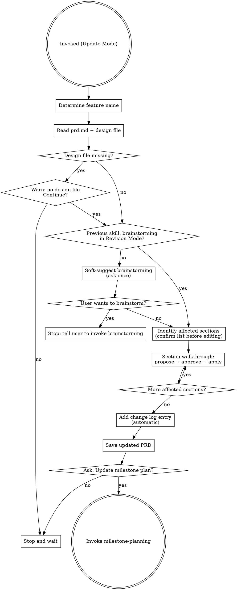

<SUBAGENT-STOP>
If you were dispatched as a subagent to execute a specific task, skip this skill.
</SUBAGENT-STOP>

Turn a brainstorming spec or rough idea into a lightweight Product Requirements Document. The PRD bridges design intent and implementation planning — it exists so future-you (and any collaborators) can understand what was built and why, without reverse-engineering the code.

This skill runs after `brainstorming` approves a spec, or when the user asks directly. It covers discovery, drafting, and handoff to `milestone-planning`. It does not touch implementation.

Discovery questions and the "keep it light" philosophy are adapted from the closedloop-ai prd-creator skill (MIT licensed).

<HARD-GATE>
Do NOT produce a PRD without explicit user confirmation. Do NOT start implementation. This skill ends when the PRD is saved and approved, or when the user declines. No exceptions.
</HARD-GATE>

## Mode Detection

When this skill activates, determine which mode applies before doing anything else:

**Update Mode** — any of these apply:
- The user's phrasing includes update/revise/change/modify language directed at an existing PRD: "update the PRD", "revise the PRD for X", "change the requirements for Y"
- The user references a feature name and a file exists at `docs/features/<name>/prd.md`

**Create Mode** — neither of the above applies and the user is creating a new PRD.

**If uncertain**, ask before proceeding:

> "Is this a new PRD or an update to an existing one?"

Do not begin either mode's checklist until the mode is confirmed.

## Checklist (Create Mode)

You MUST create a task for each of these items and complete them in order:

1. **Confirm intent** — run fallback orienting questions first if no prior brainstorming; get explicit yes before any drafting
2. **Ask presentation style** — section-by-section or full draft
3. **Determine feature name** — ask if not obvious; this determines the path `docs/features/<feature-name>/prd.md`
4. **Defensive check** — if a PRD already exists at the path (unexpected in Create Mode), stop and offer to switch to Update Mode instead
5. **Run discovery questions** — conversationally; flag assumptions as Q-### items
6. **Draft and present per chosen style** — write 15 sections, present for approval
7. **Save to file** — always to repo, never conversation-only
8. **Handoff** — ask about milestone-planning; report gracefully if unavailable

For Update Mode, see the **Update Mode** section below.

## Process Flow (Create Mode)



## The Process

### Fallback: No Prior Brainstorming (Create Mode)

If this skill is invoked in a fresh session with no prior brainstorming context, ask 2–3 quick orienting questions before running discovery. The goal is just enough baseline to know what we're talking about — not a full brainstorming session.

Ask one at a time:

1. "What are we building? Give me a one-liner."
2. "What problem does it solve, or what does it enable?"
3. "Is this something new, a change to something existing, or a standalone tool?"

If the user says "a change to something existing" in response to question 3, stop the Fallback and switch to Update Mode (see the Update Mode section below). Otherwise, continue to Step 1. If the user's answers suggest the idea needs more exploration before a PRD makes sense, say so and suggest running `brainstorming` first.

### Step 1: Confirm intent

Even when invoked explicitly, confirm before producing anything:

> "I can write a PRD for this. Want me to proceed?"

If the user says no, stop and wait. If yes, continue.

### Step 2: Ask presentation style

> "How would you like to review the PRD as I write it — section by section so we can refine each part, or as a complete first draft you review all at once?"

Hold the answer — it determines how Step 6 runs.

### Step 3: Determine feature name

Default path: `docs/features/<feature-name>/prd.md`

If the feature name isn't obvious from the conversation, ask:

> "What should I call this feature? I'll save the PRD to `docs/features/<name>/prd.md`."

Confirm the name before proceeding.

### Step 4: Defensive check

Check whether a file already exists at `docs/features/<feature-name>/prd.md`. A PRD at this path is unexpected in Create Mode — it means Mode Detection may have missed an update scenario. If the file exists, stop and tell the user:

> "A PRD already exists at `docs/features/<feature-name>/prd.md`. Did you mean to update it? I can switch to Update Mode."

- If yes → switch to Update Mode.
- If no → stop and wait; do not overwrite.

### Step 5: Discovery questions

Run the questions from the **Discovery Questions** section below. Ask them conversationally — one at a time, following the thread of the user's answers.

If brainstorming context already answers a question, skip it or briefly confirm: "I have [X] from the design doc — is that still accurate?" Fill remaining gaps with reasonable assumptions and flag each one as a `Q-###` item for the Open Questions section.

### Step 6: Draft and present per chosen style

Draft the 15 sections per the **PRD Structure** below. Write for a solo developer audience — no jargon. Aim for 2–3 printed pages total; allow longer when the content genuinely requires it.

Then present per the style chosen in Step 2:

- **Section-by-section:** Present each section and wait for the user's thumbs-up before continuing. If they want changes, revise and re-present that section before moving on.
- **Full draft:** Present the complete PRD in one block. Wait for overall approval before saving.

### Step 7: Save to file

Write the approved PRD to the file path from Step 3. Always save to the repo — never leave the PRD as conversation-only output.

### Step 8: Handoff

After saving, ask:

> "Would you like me to create a milestone implementation plan for this feature?"

- **Yes** — invoke `milestone-planning`. If the skill doesn't exist yet, say: "The `milestone-planning` skill isn't available yet — you'll need to create it before I can continue here." Stop there.
- **No** — stop and wait.

---

## Update Mode

Activates when Mode Detection determines an existing PRD is being revised. This is a focused, section-by-section update flow. The existing PRD is the anchor — do not re-run discovery or rewrite the whole document.

### Checklist (Update Mode)

You MUST create a task for each of these items and complete them in order:

1. **Determine feature name** — confirm the kebab-case name; must match `docs/features/<feature-name>/`
2. **Read context** — read `prd.md` (required) and `<feature-name>-design.md` (warn if missing, stop if user declines to continue)
3. **Brainstorming check** — if the previous skill in this session was not brainstorming in Revision Mode, soft-suggest running it first; accept whichever answer the user gives
4. **Identify affected sections** — ask what's changing; confirm the list of PRD sections that need updates before touching anything
5. **Section-by-section walkthrough** — for each affected section: propose the specific update, get approval, apply in-place; leave untouched sections alone
6. **Add change log entry** — automatic, no per-update question; add to the Change Log section (create it if absent)
7. **Save the updated PRD** — overwrite the existing file
8. **Cascading handoff** — ask about updating the milestone plan

### Process Flow (Update Mode)



### Fallback: No Existing PRD Found

If Step U2 finds no file at `docs/features/<feature-name>/prd.md`, stop the update flow:

> "I don't find an existing PRD at `docs/features/<feature-name>/prd.md`. Did you mean to create a new one? If so, I can switch to Create Mode. If not, check the feature name and try again."

- If the user confirms new PRD → switch to Create Mode from Step 1.
- Otherwise → stop and wait.

### Step U1: Determine feature name

Confirm the kebab-case name of the feature. This determines the canonical path `docs/features/<feature-name>/`. If the name isn't clear from the conversation, ask:

> "What's the feature name? I'll look for the PRD at `docs/features/<name>/prd.md`."

### Step U2: Read context

Read `docs/features/<feature-name>/prd.md` — this is required. If it doesn't exist, see the Fallback above.

Also read `docs/features/<feature-name>/<feature-name>-design.md` if it exists. If it does not, warn:

> "I don't see a design file at `docs/features/<feature-name>/<feature-name>-design.md`. Design files are usually created by brainstorming before PRDs. Without one, this update won't have design context as an anchor. Continue anyway?"

- If the user declines: stop and wait.
- If the user confirms: continue, noting that the PRD itself is the primary anchor.

### Step U3: Brainstorming check

If the previous skill invoked in this session was brainstorming in Revision Mode, skip the check — the change has already been discussed. Otherwise, ask once:

> "Did you want to brainstorm this change first? It often helps to talk through the design before updating the PRD. Or we can proceed directly if you've already thought it through."

- If they want to brainstorm: stop and tell them to invoke brainstorming.
- If they want to proceed: continue. Do not ask again.

### Step U4: Identify affected sections

Ask what's changing:

> "Walk me through what's changing. I'll identify which PRD sections need updates."

From the user's description, list the specific sections that need to be modified. Present the list and confirm before touching anything:

> "Based on what you've described, I'd update these sections: [list]. Does that look right?"

Wait for confirmation. Adjust the list if the user adds or removes sections.

### Step U5: Section-by-section walkthrough

For each section in the confirmed list, in order:

1. Quote the current section content
2. Propose the specific delta: "In [Section Name], I'd change [X] to [Y]" — not a full rewrite, just what changes
3. Wait for the user's approval or revision request
4. Apply the approved change in-place
5. Move to the next section

Sections not in the list are left exactly as they are. If it becomes clear mid-walkthrough that another section also needs updating, pause and add it to the list before continuing.

### Step U6: Add change log entry

After all sections are updated, automatically add a change log entry. This step is not optional and requires no per-update user confirmation.

**If the PRD does not yet have a Change Log section**, insert one immediately after the Executive Summary:

```markdown
## Change Log

- YYYY-MM-DD: <one-line summary of what changed>. Affected: <comma-separated section names>.
```

**If a Change Log section already exists**, prepend the new entry at the top of the existing list (newest-first).

Use today's date. The one-line summary should be descriptive enough to understand the change without reading the diff.

### Step U7: Save the updated PRD

Overwrite `docs/features/<feature-name>/prd.md` with the updated content. Always save to the repo.

### Step U8: Cascading handoff

After saving, ask:

> "Does the plan need updating too? If yes, I'll hand off to milestone-planning."

- **Yes** — invoke `milestone-planning`. It will read the existing plan and handle the update.
- **No** — stop and wait.

---

## Discovery Questions

Ask these conversationally, one at a time. Don't read them as a list. Follow the user's answers — if one answer makes the next question obvious, weave it in naturally.

1. **Problem** — "What's the friction or gap this solves? What breaks down or goes missing without it?"
2. **Evidence** — "What's making this feel real — something you've hit repeatedly, feedback you've received, a hunch that won't go away?"
3. **Why now** — "Why build this now rather than later? What's the cost of not having it — what keeps happening in the meantime?"
4. **Persona** — "Who's the primary user here — you, a specific type of end user, an external API consumer, something else?"
5. **Success** — "What does 'this worked' look like when it's done? What changes, and how would you know?"
6. **First slice** — "What's the smallest version you'd actually use or ship? What can be deferred?"
7. **Risks** — "Any technical constraints, dependencies, security concerns, or integrations that might complicate this?"

Fill gaps with reasonable assumptions. Flag each assumption as a `Q-###` item in the Open Questions section.

---

## PRD Structure

### Part 1 — Business Context

**1. Executive Summary**
2–3 sentences. The 15-second version: what it is, who it's for, why it matters.

**2. Overview**
One paragraph, plain language. What does this feature do?

**3. Background**
Brief context. Why does this exist now? What led here?

**4. Stakeholders**
Bulleted list, no prose. Who is the user, who owns it, who needs to be kept informed.

**5. Business Impact**
Plain-language "so what." What gets better when this ships? Keep this distinct from metrics — this is the narrative, not the numbers.

**6. Goals & Success Metrics**
Measurable outcomes. What specific numbers or behaviors indicate success?

**7. User Stories**
Format: `US-### — As a [user], I want [action] so that [outcome].`

**8. Out of Scope**
Explicit non-goals. What are we deliberately not building?

**9. Sequencing**
Relative ordering only: first, then, finally. No dates, no weeks, no quarters.

---

> The sections below are for the implementation team. Business readers can stop here.

---

### Part 2 — For Implementation Team

**10. Requirements**
Functional and non-functional. Engineer language is fine here.

**11. User Experience**
Key workflows, edge cases, error states.

**12. Technical Considerations**
Dependencies, constraints, architectural notes.

**13. Acceptance Criteria**
Format: `AC-###.# — Given [context], when [action], then [outcome].`
Tie each AC to a US-### ID where applicable.

**14. Open Questions**
Format: `Q-### — [question or flagged assumption]`

**15. Risks & Mitigations**
What could go wrong, and how would you address it?

### Change Log (Update Mode only)

The Change Log is not part of freshly created PRDs. Update Mode inserts it after the Executive Summary when the PRD is first revised. Format:

```markdown
## Change Log

- YYYY-MM-DD: <one-line summary>. Affected: <section names>.
```

Entries are ordered newest-first. The change log is maintained automatically by Update Mode — it does not require user input.

---

## ID Conventions

| Type | Format | Example |
|---|---|---|
| User Story | US-### | US-001, US-002 |
| Acceptance Criteria | AC-###.# | AC-001.1, AC-001.2 |
| Open Question | Q-### | Q-001, Q-002 |

Acceptance Criteria IDs reference their parent User Story (AC-001.x belongs to US-001).

---

## Keep It Light

- Flag assumptions as `Q-###` items rather than stopping to ask about every gap
- Timelines belong in `milestone-planning`, not here — section 9 uses relative sequencing only
- Any section can be regenerated or expanded later
- A PRD that ships is better than a perfect one that doesn't
- Aim for 2–3 printed pages; go longer only when the content genuinely requires it

---

## Hard Rules

- **Never produce a PRD without explicit user confirmation.** Always ask first.
- **Never start implementation from this skill.** This skill ends at PRD approval and handoff.
- **Never replace an existing PRD without user approval.** In Create Mode, stop if a PRD exists at the target path and offer Update Mode. In Update Mode, the save step is an intentional replacement after the user has approved each change during the section-by-section walkthrough.
- **Always save to file in the repo.** Never leave the PRD as conversation-only output.
- **The visual divider between Part 1 and Part 2 is mandatory.** It must appear in every PRD.
- **In Update Mode, always add a change log entry.** No exceptions, no per-update question. Every save gets a dated entry.
- **In Update Mode, never rewrite the whole PRD.** Update only the affected sections in place. Untouched sections stay exactly as they are.
- **In Update Mode, the design file is the anchor.** If the design file and PRD have diverged significantly, flag it and ask the user which to align with before making changes.
- **Confirm the affected section list before editing anything in Update Mode.** Identification and walkthrough are two distinct steps — never collapse them.

---

## Red Flags

| Thought | Reality |
|---|---|
| "I'll just draft a quick PRD to get things moving" | Never produce a PRD without explicit user confirmation. Ask first, always. |
| "The PRD is done, I can start on the implementation now" | This skill stops at PRD approval. Never start implementation. Invoke `milestone-planning` or stop. |
| "I'll update the PRD with these new requirements" | Mode Detection routes update requests into Update Mode. Follow the Update Mode checklist — confirm affected sections, walk through them, add a change log entry. |
| "I'll just rewrite the whole PRD from scratch — it's faster than section-by-section" | NO. Update in place. Sections not in the affected list stay exactly as they are. The user's existing content has value. |
| "The user said 'update the PRD' but the scope isn't clear — I'll update everything that seems relevant" | NO. Ask first. Confirm the list of affected sections explicitly before editing anything. |
| "This change is minor, I'll skip the change log entry" | NO. Every Update Mode save gets a dated change log entry. No exceptions. |
| "I don't see a design file but the PRD exists — I'll use the PRD as context and proceed" | WARN the user the design file is missing. Only proceed if they explicitly confirm. The PRD alone is an incomplete anchor. |
