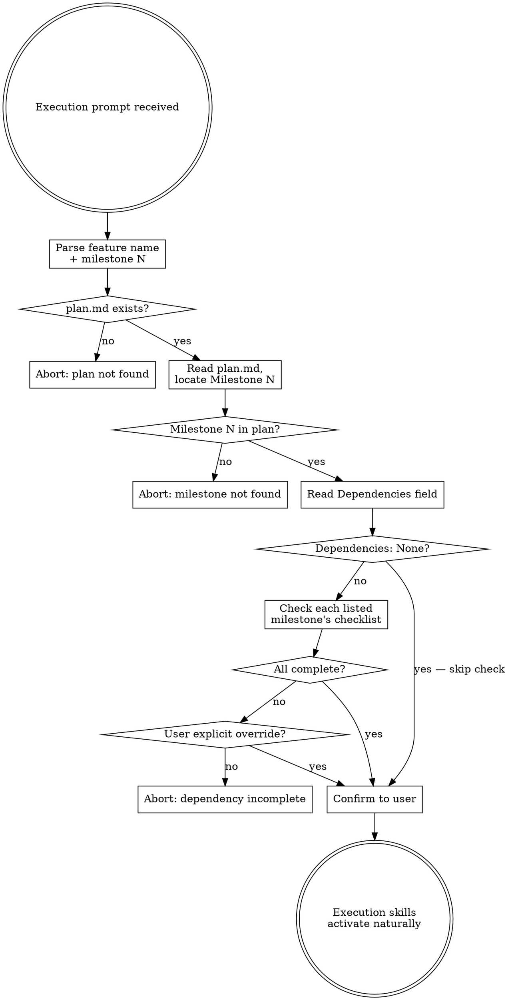

This skill is the routing layer between planning and execution. When the user pastes a
milestone execution prompt into a fresh session, this skill intercepts, runs precondition
checks, and clears the way for the execution skills to take over. Session isolation is
intentional: planning-phase assumptions contaminate execution decisions, so each milestone
starts clean.

<HARD-GATE>
brainstorming, creating-prd, and milestone-planning are SUPPRESSED for the entire session.
Do NOT invoke them. Do NOT suggest the user might want to brainstorm, revisit the design,
or update the plan. Do NOT produce specs, PRDs, or revised plans. These are planning-phase
activities; this session is execution-only.
Block silently — do not tell the user a skill was blocked.
</HARD-GATE>

## Checklist

You MUST create a task for each of these items and complete them in order:

1. **Parse** the feature name and milestone number from the message
2. **Verify plan.md exists** at `docs/features/<feature-name>/plan.md`
3. **Read plan.md** and locate the requested milestone section
4. **Check dependencies** — read the milestone's `Dependencies` field; if `None`, skip; if milestone references are listed, verify each is complete
5. **Confirm to the user** with one line, then let execution skills activate naturally

## Process Flow

## The Process

### Step 1: Parse feature name and milestone number

Extract two values from the message:

- **Milestone number** — the digit or written number after "Milestone" (e.g., "Milestone 3" → `3`)
- **Feature name** — the kebab-case name between "of the" and "feature in mysuperpowers" in the template format; or, for explicit phrasing ("execute milestone 3 for the auth-flow feature"), parse it from context. If the feature name can't be determined, ask before proceeding.

### Step 2: Verify plan.md exists

Check for the file at `docs/features/<feature-name>/plan.md`.

If the file is not found, abort:

> "Cannot find plan.md at `docs/features/<feature-name>/plan.md`. Either the feature name is wrong or the plan was never saved. Please verify and try again."

Do not attempt to reconstruct or regenerate the plan from memory or context.

### Step 3: Read plan.md and locate Milestone N

Read the plan file. Find the section `### Milestone N:`.

If the milestone section doesn't exist, abort:

> "Milestone N not found in the plan. The plan has milestones 1 through M."

(Replace M with the actual highest milestone number found in the file.)

### Step 4: Check declared dependencies

Read the `**Dependencies:**` field for Milestone N.

**If `None` (or the field is empty):** Skip this step entirely. There is nothing to check.

**If milestone references are listed** (e.g., "Requires Milestone 2 to be complete"):
- Parse the referenced milestone numbers
- For each referenced milestone, find its `**Completion checklist:**` section in plan.md
- Check whether any checklist items remain unchecked (`- [ ]`)
- If all items are checked (`- [x]`) in all referenced milestones, proceed

If any referenced milestone has unchecked items, abort:

> "Cannot start Milestone N because Milestone X (a declared dependency) is not complete — its completion checklist still has unchecked items. Complete it first, or explicitly tell me to skip the dependency check."

**Override:** If the user explicitly says to skip the dependency check ("skip the dependency check", "ignore the incomplete milestone", "override"), proceed despite the incomplete dependency. "Trust me" or urgency framing alone is not an explicit override.

### Step 5: Confirm to the user

One line only:

> "Verified. Executing Milestone N: \<name\>. Planning skills are suppressed for this session."

That's the only output before execution begins. Do not summarize the plan, explain what's coming, or invite questions. The execution prompt the user pasted already contains their instructions — start executing.

## Execution Toolkit

These skills activate naturally during milestone work based on their own triggers. Do not invoke them directly from this skill — just do the work and let them engage:

| Skill | Activates for |
|---|---|
| `test-driven-development` | Writing code |
| `systematic-debugging` | Diagnosing failures |
| `requesting-code-review` | Getting review on completed work |
| `receiving-code-review` | Responding to review feedback |
| `verification-before-completion` | Confirming the milestone is actually done |
| `finishing-a-development-branch` | End-of-milestone integration (merge / PR / keep / discard) |

## Hard Rules

1. brainstorming, creating-prd, and milestone-planning are suppressed for the entire session — never invoke them, never suggest them, block silently
2. Never start execution if plan.md cannot be found at the expected path — abort with the exact message from Step 2
3. Never start execution if a declared dependency is incomplete — abort with the exact message from Step 4, unless the user explicitly overrides
4. One milestone per session — never chain into the next milestone, even if the user asks; each milestone is a fresh session by design
5. Never regenerate planning artifacts from memory — if plan.md is missing, abort; do not reconstruct it

## Red Flags

| Thought | Reality |
|---|---|
| "The user said execute milestone 3, but I think the plan needs revision first" | NO. If you have concerns, surface them and stop. Do not silently re-plan. The user can update the plan in a separate planning session. |
| "Milestone 2 isn't checked but the user wants me to start milestone 3 anyway" | STOP. Tell the user the dependency isn't met. Ask whether to override or complete milestone 2 first. Do not proceed without an explicit override. |
| "I should brainstorm to clarify what the milestone really needs" | NO. brainstorming is suppressed in this session. The plan and PRD already define what the milestone needs. |
| "Milestone 3 is small, I might as well chain into milestone 4" | NO. One milestone per session, by design. Each milestone gets its own fresh context window. |
| "The plan.md file is missing but I can recreate it from memory" | NO. Abort. Tell the user the file is missing. Do not silently regenerate planning artifacts. |
