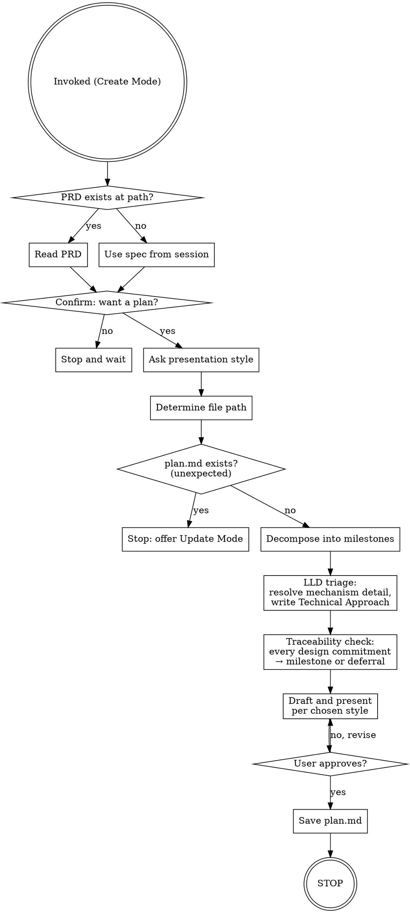
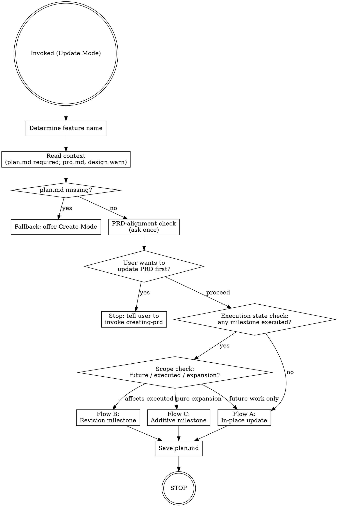

<SUBAGENT-STOP>
If you were dispatched as a subagent to execute a specific task, skip this skill.
</SUBAGENT-STOP>

This skill turns an approved spec or PRD into a sequenced milestone plan. It covers decomposition, drafting, and saving `plan.md`. It does not touch implementation.

Session boundaries are intentional, not ceremony. Each milestone runs in a fresh session so it gets a clean context window — a session that starts mid-planning carries planning-phase assumptions that can muddle implementation decisions. The plan file contains an execution prompt for each milestone; the user pastes it into a new session when they're ready to execute.

<HARD-GATE>
Do NOT produce a plan without explicit user confirmation. Do NOT start implementation. Do NOT chain into execution after saving plan.md. This skill ends when the plan is saved and approved, or when the user declines. No exceptions.
</HARD-GATE>

## Mode Detection

When this skill activates, determine which mode applies before doing anything else:

**Update Mode** — any of these apply:
- The user's phrasing includes update/revise/change/modify language directed at an existing plan: "update the plan", "revise the plan for X", "add a revision milestone", "modify the plan for Y"
- The user references a feature name and a file exists at `docs/features/<name>/plan.md`

**Create Mode** — neither of the above applies and the user is creating a new plan.

**If uncertain**, ask before proceeding:

> "Is this a new plan or an update to an existing one?"

Do not begin either mode's checklist until the mode is confirmed.

## Checklist (Create Mode)

You MUST create a task for each of these items and complete them in order:

1. **Read source material** — PRD at `docs/features/<feature-name>/prd.md` if it exists; otherwise the brainstorming spec from the current session. Also read the design doc at `docs/features/<feature-name>/<feature-name>-design.md` if it exists (architecture context + Mechanism risk areas for LLD triage)
2. **Confirm intent** — get explicit yes before drafting anything
3. **Ask presentation style** — milestone-by-milestone or full draft
4. **Determine file path** — confirm `docs/features/<kebab-name>/plan.md`
5. **Defensive check** — if plan.md already exists at the path (unexpected in Create Mode), stop and offer to switch to Update Mode instead
6. **Decompose into milestones** — apply granularity rules; define all required fields for each milestone
7. **LLD triage + Technical Approach** — collect mechanism-risk flags from the design doc and PRD, triage which components need low-level design, resolve each with the user, write a Technical Approach into the owning milestone
8. **Design→plan traceability check** — walk the design's component map and Harness Design section; every commitment maps to a milestone or lands in the plan's "Deferred from design" list with the user's sign-off
9. **Draft and present per chosen style** — wait for approval before saving
10. **Save plan.md then STOP** — do not chain into execution; the user starts each milestone in a fresh session

For Update Mode, see the **Update Mode** section below.

## Process Flow (Create Mode)



## The Process (Create Mode)

### Step 1: Read source material

Look for `docs/features/<feature-name>/prd.md`. If it exists, read it — this is the primary input for decomposition. If not, use the brainstorming spec from the current session. If neither is available, ask the user to describe the feature goal before continuing.

Also read `docs/features/<feature-name>/<feature-name>-design.md` if it exists — it supplies architectural context for decomposition and the **Mechanism risk areas** section consumed by LLD triage (Step 7). Where the design and PRD disagree, the PRD governs.

### Step 2: Confirm intent

Even when invoked explicitly, confirm before producing anything:

> "I can create a milestone implementation plan for this. Want me to proceed?"

If no, stop and wait. If yes, continue.

### Step 3: Ask presentation style

> "How would you like to review the plan — **focused review** (I draft everything, then point you at the decomposition and sequencing choices that need your input — recommended), **milestone by milestone**, or a **complete draft** you read all at once?"

Note: LLD triage (Step 7) is always interactive regardless of the style chosen here — mechanism decisions need the user either way. The style only governs how the drafted plan is reviewed.

Hold the answer — it determines how Step 9 runs.

### Step 4: Determine file path

Default path: `docs/features/<kebab-name>/plan.md`

If the feature name isn't obvious from context, ask:

> "What should I call this feature? I'll save the plan to `docs/features/<name>/plan.md`."

Confirm the path before writing.

### Step 5: Defensive check

Check whether a file already exists at `docs/features/<feature-name>/plan.md`. A plan at this path is unexpected in Create Mode — it means Mode Detection may have missed an update scenario. If the file exists, stop and tell the user:

> "A plan already exists at `docs/features/<feature-name>/plan.md`. Did you mean to update it? I can switch to Update Mode."

- If yes → switch to Update Mode.
- If no → stop and wait; do not overwrite.

### Step 6: Decompose into milestones

Break the work into milestones using the rules in **Milestone Granularity** below. For each milestone, define:

- **Name** — short and descriptive
- **Goal** — what this milestone achieves
- **Files affected** — list of expected files to change
- **Dependencies** — plain language: "None" or "Requires Milestone N to be complete (reason)"
- **Completion checklist** — the standard four items (see **plan.md Structure**)
- **Technical Approach** — only for milestones containing LLD-flagged components; produced in Step 7
- **Execution prompt** — generated from **Execution Prompt Template**

**Evals milestone (AI-agent features):** if the design's Harness Design section includes evals — and always when an LLM decision point gates an autonomous action (send, book, delete, pay) — the eval work must appear explicitly in the plan: a labeled eval set, an eval harness/runner, threshold validation for autonomy gates, and a regression run wired into prompt/model changes. Default to proposing a **dedicated evals milestone**, sequenced before the milestone that enables the autonomous action; fold eval tasks into the owning milestones only if the user prefers. If the user declines evals entirely, record that in the plan's "Deferred from design" list — never drop it silently. Observability, guardrails, and other harness dimensions follow the same rule: they get milestone work or an explicit deferral, decided in Step 8.

### Step 7: LLD triage + Technical Approach

The execution session is a fresh context with the least information of anyone in the workflow. Any mechanism left unspecified here is silently delegated to it. This step decides — deliberately, with the user — what gets specified and what is genuinely left to the implementer.

**Collect candidates** from three sources:
1. The design doc's **Mechanism risk areas** section (if present)
2. PRD `Q-###` items marked "mechanism unspecified"
3. Your own scan of the milestones: any component involving external integrations, crawling/scraping/parsing, extraction heuristics, matching/detection logic, or non-trivial algorithms

**Triage each candidate** with this test: *would two competent implementers build materially different internals, in a way the executing agent's own tests wouldn't catch as wrong?*
- **Yes → needs LLD.** Typical: query construction against an external API, page-parsing strategy, email/entity extraction heuristics, confidence thresholds, retry/fallback decision rules.
- **No → skip.** Typical: CRUD endpoints, standard UI screens, ORM models, glue code. Do NOT write LLD for these — it bloats the plan and goes stale.

**Resolve interactively.** For each flagged component, present the concrete open choices in one batch with your recommended answer for each (e.g. "Email discovery: I propose Google Custom Search API with query `"<PI name>" <institution> email site:.edu`, top-3 results fetched, regex + obfuscation patterns for extraction, and a domain-match check against the institution before trusting a hit. Three things need your call: API vs scraping, what counts as a confident match, and retry cadence for not-found leads."). Let the user decide only the genuinely open items; take silence on your recommendations as acceptance after confirmation.

**Write the Technical Approach** into the owning milestone (see plan.md Structure). Content per flagged component:
- The algorithm/flow as numbered steps or short pseudocode
- Key data shapes (inputs, outputs, stored fields)
- External API specifics: endpoints, query construction, rate limits, quotas
- Failure and fallback decision rules (what routes where, and when)
- Explicit **"implementer's discretion"** markers for anything intentionally left open

Keep each component's LLD to roughly 20–60 lines — enough to remove ambiguity, not an implementation. If a mechanism can't be specified because nobody knows the answer yet (e.g. unknown data quality of an external source), propose a **spike milestone** to validate the approach instead of guessing.

### Step 8: Design→plan traceability check

The decomposition in Step 6 is built from the PRD's requirements — design commitments that never became FRs (harness infrastructure especially: evals, observability, memory, guardrails) can silently fall out here. This step catches them before the plan is presented.

Walk two lists from the design doc and, for each item, name the milestone that delivers it:

1. **The component map** (or equivalent architecture section) — every component belongs to some milestone.
2. **The Harness Design section** (AI-agent features) — every dimension not marked N/A belongs to some milestone. Check evals against the Step 6 rule above.

For any item with no owning milestone, resolve it with the user: add it to an existing milestone, create a new one, or defer it deliberately. Deferred items go in the plan's **Deferred from design** list (see plan.md Structure) — one line each: what, why, and what would trigger revisiting. An empty traceability gap list is the goal; a silent one is the failure.

### Step 9: Draft and present per chosen style

- **Focused review (recommended):** Present the complete plan, but lead with the items needing the user's judgment: decomposition choices that could reasonably go another way, dependency/sequencing decisions, and any milestone whose scope you were unsure about. Name the milestones that are conventional in one line. Resolve the input items, then get overall approval. (Technical Approach content was already user-approved in Step 7 — don't re-litigate it.)
- **Milestone-by-milestone:** Present each milestone and wait for thumbs-up before continuing. Revise and re-present if the user wants changes.
- **Full draft:** Present the complete plan in one block. Wait for overall approval before saving.

### Step 10: Save plan.md then STOP

Write the approved plan to the file path from Step 4. Always save to the repo — never leave plan.md as conversation-only output.

Then stop. Do not offer to begin execution. Do not suggest starting milestone 1. The user will open a new session and paste the execution prompt from plan.md when they're ready.

---

## Update Mode

Activates when Mode Detection determines an existing plan is being revised. Three distinct flows handle different states of execution: in-place updates, revision milestones, and additive milestones. The preconditions determine which flow applies before any editing begins.

### Checklist (Update Mode)

You MUST create a task for each of these items and complete them in order:

1. **Determine feature name** — confirm the kebab-case name; must match `docs/features/<feature-name>/`
2. **Read context** — read `plan.md` (required), `prd.md` (warn if missing), and `<feature-name>-design.md` (warn if missing)
3. **PRD-alignment check** — ask whether the PRD has been updated to reflect this change
4. **Execution state check** — ask whether any milestone has been executed
5. **Scope check** (only if milestones have been executed) — determine which flow applies
6. **Run the selected flow** — Flow A (in-place), Flow B (revision milestone), or Flow C (additive milestone)
7. **Save the updated plan** — overwrite plan.md
8. **STOP** — the same hard-stop as Create Mode; do not chain into execution

### Process Flow (Update Mode)



### Fallback: No Existing Plan Found

If Step U2 finds no file at `docs/features/<feature-name>/plan.md`, stop the update flow:

> "I don't find an existing plan at `docs/features/<feature-name>/plan.md`. Did you mean to create a new one? If so, I can switch to Create Mode. If not, check the feature name and try again."

- If the user confirms new plan → switch to Create Mode from Step 1.
- Otherwise → stop and wait.

### Step U1: Determine feature name

Confirm the kebab-case name of the feature. This determines the canonical path `docs/features/<feature-name>/`. If the name isn't clear from the conversation, ask:

> "What's the feature name? I'll look for the plan at `docs/features/<name>/plan.md`."

### Step U2: Read context

Read `docs/features/<feature-name>/plan.md` — this is required. If it doesn't exist, see the Fallback above.

Also read `docs/features/<feature-name>/prd.md`. If it does not exist, warn:

> "I don't see a PRD at `docs/features/<feature-name>/prd.md`. Plans are usually based on an approved PRD. Without one, this update won't have requirements context as an anchor. Continue anyway?"

Also read `docs/features/<feature-name>/<feature-name>-design.md`. If it does not exist, warn:

> "I don't see a design file at `docs/features/<feature-name>/<feature-name>-design.md`. Without one, this update won't have the original design intent as context. Continue anyway?"

If the user declines either warning: stop and wait. If they confirm: continue.

### Step U3: PRD-alignment check

Ask once:

> "Has the PRD been updated to reflect this change? Plans should track what's in the PRD. If the PRD hasn't been updated yet, it's often better to update it first before revising the plan."

- If they want to update the PRD first: stop and tell them to invoke `creating-prd`.
- If they say no or want to proceed anyway: continue. Do not ask again.

### Step U4: Execution state check

Ask:

> "Has any milestone in this plan been executed yet?"

- **No** → go directly to Flow A (in-place update).
- **Yes** → continue to Step U5.

### Step U5: Scope check

Only runs if Step U4 confirmed that milestones have been executed. Ask:

> "Does your change affect work that's already been executed, or only future work? Or is this a pure scope expansion — adding new work without changing anything that's already been done?"

Based on the answer:
- "Only future work" → **Flow A** (in-place update)
- "Affects executed work" → **Flow B** (revision milestone)
- "Pure scope expansion" → **Flow C** (additive milestone)

If the answer is ambiguous, ask a follow-up: "Is any of the existing completed work being undone, superseded, or reworked — or is this purely an addition?"

### Step U6: Run the selected flow

---

#### Flow A — In-place update

Use when the change affects only milestones that have not yet been executed, or future milestones.

1. Ask what's changing and which milestones are affected
2. Confirm the list of affected milestones before touching anything
3. For each affected milestone in order:
   - Check whether any completion checklist items are checked (i.e., the milestone has been fully or partially executed)
   - If any items are checked, show a warning before proceeding:
     > "Milestone N has completed checklist items. Editing it in-place may invalidate committed work from execution. Proceed anyway?"
     Wait for explicit user confirmation. If they decline: skip this milestone or stop, per their choice.
   - If no items are checked: proceed without warning
   - Walk through the milestone field by field (Goal, Files affected, Dependencies, Technical Approach if present, Completion checklist, Execution prompt): quote the current value, propose the specific change, wait for approval, apply in-place. If the change introduces a new mechanism-risky component, run the LLD triage test on it and add or extend the Technical Approach accordingly
4. Preserve all milestone numbers — do not renumber

---

#### Flow B — Revision milestone

Use when the change supersedes or reworks something already executed.

1. Ask what's changing and what existing work is being superseded or reworked
2. Determine the next available integer: N+1 where N is the highest existing milestone number
3. Check whether a revision milestone already exists anywhere in the plan. If yes, warn:
   > "Revision milestone M already exists in the plan. Adding Milestone N (Revision) now — both revisions will coexist. Proceed?"
   Wait for confirmation.
4. Construct the new milestone using the format `### Milestone N (Revision): <name>`
5. Fill in all required fields (see **Revision and Additive Milestone Blocks** in plan.md Structure). If the milestone contains mechanism-risky components, run the LLD triage test and include a Technical Approach
6. Append the milestone to the end of plan.md, after all existing milestones

---

#### Flow C — Additive milestone

Use when the change is a pure scope expansion — new work without modifying existing milestones.

1. Ask what's being added and why it wasn't in the original plan
2. Determine the next available integer: N+1
3. Construct the new milestone using the format `### Milestone N (Additive): <name>`
4. Fill in all required fields (see **Revision and Additive Milestone Blocks** in plan.md Structure). No Supersedes field for additive milestones. If the milestone contains mechanism-risky components, run the LLD triage test and include a Technical Approach.
5. Append the milestone to the end of plan.md, after all existing milestones

---

### Step U7: Save the updated plan

Overwrite `docs/features/<feature-name>/plan.md` with the updated content. Always save to the repo.

### Step U8: STOP

Stop. Do not offer to begin execution. Do not chain into any next step. The same HARD-GATE that applies in Create Mode applies here: this skill ends when the plan is saved. The user starts execution in a fresh session.

---

## plan.md Structure

The approved plan file must follow this layout exactly. Execution sessions depend on consistent field names and formatting.

**Header block:**

```
# Implementation Plan: Feature Name

**Source:** docs/features/feature-name/prd.md  (or "brainstorming spec only")
**Created:** YYYY-MM-DD

## Overview
1-2 sentence summary of the plan approach.

## Deferred from design
- <design commitment> — <why deferred> — revisit when <trigger>

## Milestones
```

The **Deferred from design** section is present only when the Step 8 traceability check produced user-approved deferrals — omit it entirely when every design commitment has an owning milestone. It is the plan's record that a gap is deliberate, not missed.

**Each milestone block (repeat for each milestone, separated by `---`):**

```
### Milestone N: Short name
**Goal:** What this milestone achieves.
**Files affected:** list of expected files
**Dependencies:** None (or "Requires Milestone N to be complete — reason")

**Technical Approach:** *(only present when the milestone contains LLD-flagged components — omit the field entirely otherwise)*
Mechanism-level spec produced in the LLD triage step: algorithm/flow, key data shapes, external API specifics, failure/fallback rules, and explicit "implementer's discretion" markers.

**Completion checklist:**
- [ ] Tests written and passing
- [ ] Code review requested and addressed
- [ ] All acceptance criteria for this milestone met
- [ ] Plan file updated with completion notes

**Execution prompt:**
[fenced code block containing the generated execution prompt — see Execution Prompt Template]

**Completion notes:** *(filled in after execution)*
**Integration outcome:** *(filled in after execution — e.g., merged to main, PR #123, kept as branch feature-name)*
```

Completion notes and integration outcome are left blank in the plan — the execution session fills them in after the milestone is complete.

**Revision and Additive Milestone Blocks**

**Revision milestone block (Flow B — append to end of plan.md):**

```
### Milestone N (Revision): Short name
**Goal:** What this revision milestone achieves.
**Files affected:** list of expected files
**Dependencies:** None (or "Requires Milestone N to be complete — reason")
**Supersedes:** Milestone X (optional — only include if there is a direct relationship to a prior milestone)
**Change summary:** 1-2 sentences describing what prior work is being reworked, superseded, or corrected, and why.
**Technical Approach:** *(only when the milestone contains LLD-flagged components — omit otherwise)*

**Completion checklist:**
- [ ] Tests written and passing
- [ ] Code review requested and addressed
- [ ] All acceptance criteria for this milestone met
- [ ] Plan file updated with completion notes

**Execution prompt:**
[fenced code block containing the generated execution prompt — see Execution Prompt Template]

**Completion notes:** *(filled in after execution)*
**Integration outcome:** *(filled in after execution)*
```

**Additive milestone block (Flow C — append to end of plan.md):**

```
### Milestone N (Additive): Short name
**Goal:** What this additive milestone achieves.
**Files affected:** list of expected files
**Dependencies:** None (or "Requires Milestone N to be complete — reason")
**Change summary:** 1-2 sentences describing what new scope is being added and why it wasn't in the original plan.
**Technical Approach:** *(only when the milestone contains LLD-flagged components — omit otherwise)*

**Completion checklist:**
- [ ] Tests written and passing
- [ ] Code review requested and addressed
- [ ] All acceptance criteria for this milestone met
- [ ] Plan file updated with completion notes

**Execution prompt:**
[fenced code block containing the generated execution prompt — see Execution Prompt Template]

**Completion notes:** *(filled in after execution)*
**Integration outcome:** *(filled in after execution)*
```

In-place updates (Flow A) do not add a change log to plan.md — the change is reflected in the updated milestone content, and git history preserves the diff. Revision and additive milestones carry their own Change summary field instead.

---

## Execution Prompt Template

Every milestone gets an execution prompt generated from this template. Substitute milestone number, milestone name, and feature name. All other text is fixed.

```
You are executing Milestone N of the feature-name feature in mysuperpowers. The plan was created and approved in a previous session. Do NOT brainstorm. Do NOT create a PRD. Do NOT create a new plan.

## Milestone N: name

Read the following for context:
- Plan: docs/features/feature-name/plan.md (find Milestone N)
- PRD (if it exists): docs/features/feature-name/prd.md
- Design (if it exists): docs/features/feature-name/feature-name-design.md — architecture, component boundaries, and design intent

Precedence when documents disagree: plan > PRD > design. The design doc may predate requirement changes — use it for architectural context, never to override the PRD or plan.

If Milestone N has a Technical Approach section, it is binding: implement the specified mechanism, not your own alternative. Items marked "implementer's discretion" are yours to decide. If implementation reveals the specified approach is wrong or infeasible, deviate — and record the deviation and reason in the completion notes.

## Before starting
Verify in plan.md that prior milestones' completion checklists are fully checked. If a dependency milestone is incomplete, stop and tell me — do not proceed.

## Execution rules
- Use the standard mysuperpowers execution workflow: test-driven-development; do NOT commit during the TDD cycle — leave all changes uncommitted until the finishing step; use requesting-code-review and verification-before-completion as appropriate
- Work on the current branch unless I tell you otherwise — do not create a git worktree
- Do NOT start the next milestone — each milestone runs in its own session by design

## When complete
1. Update Milestone N's completion checklist in docs/features/feature-name/plan.md (check all four boxes)

   Note on the completion checklist: Complete every item that applies to this milestone honestly. If an item doesn't cleanly apply to this milestone's scope (for example, a foundation milestone may have no meaningful application code to test, a deployment config milestone may have no reviewable business logic), mark it complete with a brief annotation like "✓ N/A — [reason]". Do not invent meaningless work just to check a box. Do not leave items unchecked without explanation.

2. Add a brief completion note to plan.md (1-2 lines: what was done, any deviations from the plan)
3. Use the finishing-a-development-branch skill to present integration options (merge, PR, keep, discard). Wait for my choice before executing.
4. STOP. Do not start the next milestone. Wait for me.
```

---

## Milestone Granularity

A milestone is a logically coherent unit of work — a set of changes that belong together because they accomplish one focused goal. Use these self-checks when decomposing:

- **Coherence over size.** A milestone touching many files is fine if the changes belong together. Touching few files is not automatically good if they're unrelated.
- **Human-PR-reviewable.** If reviewing the milestone's changes in one sitting would feel exhausting or confusing, it's too big or too unfocused.
- **Trivial changes are steps, not milestones.** A one-line fix or config tweak belongs inside a larger milestone, not as its own.
- **No hard caps.** There are no hard limits on lines, files, or criteria. Use judgment.
- **When in doubt, prefer coherent and slightly larger** over fragmented and small.

---

## Hard Rules

1. Never start implementation from this skill
2. Never produce a plan without explicit user confirmation
3. **Never replace an existing plan.md without user approval.** In Create Mode, stop if plan.md exists at the target path and offer Update Mode. In Update Mode, the save step is an intentional replacement after the user has approved changes through the selected flow.
4. The planning phase never produces or commits application code — committing the planning documents themselves (design doc, prd.md, plan.md) is expected
5. The execution phase does NOT commit during the TDD cycle — all changes remain uncommitted; finishing-a-development-branch checks for uncommitted changes, asks for user approval before committing, then presents integration options; the user always chooses the integration action (merge/PR/keep/discard)
6. Never renumber milestones after the plan is created — insertions go at the end as new milestones with the next available number
7. Always save plan.md to the repo — never leave as conversation-only output
8. After plan.md is saved, STOP — do not chain into execution
9. **In Update Mode, never renumber existing milestones.** Revision and additive milestones append at the end using the next available integer. Renaming or reshuffling existing milestone numbers is forbidden.
10. **Revision and additive milestones are append-only.** Once added, they are not modified — they are permanent records of plan evolution.
11. **In-place updates to milestones with completed checklist items always require explicit user confirmation.** The warning is never skipped, even for small changes.
12. **The HARD-GATE applies identically in Update Mode.** Update Mode ends when plan.md is saved. Never chain into execution.
13. **PRD-alignment is a user decision.** Always ask. Never skip the question. Proceed regardless of the answer — the user decides whether to update the PRD first.
14. **If the change would invalidate a milestone currently in progress, warn before proceeding.** A milestone in progress has some but not all checklist items checked.

If the user asks to begin implementation during or after planning, politely decline and explain: each milestone runs in its own fresh session by design. The plan file contains an execution prompt they can paste into a new session to begin.

---

## Red Flags

| Thought | Reality |
|---|---|
| "The plan is approved, I'll just start milestone 1 to be helpful" | NO. Planning ends in this session by design. Each milestone runs in a fresh session for context isolation. Stop after saving. |
| "The user said this is urgent, I'll skip planning and just implement" | Only skip if the user EXPLICITLY says to skip. Don't infer urgency from tone and bypass the workflow. |
| "Milestone 1 is small, I might as well chain into milestone 2" | NO. Even small milestones run in their own session. Session boundaries are intentional, not overhead. |
| "I'll batch tiny milestones together to save sessions" | NO. The point of fresh sessions is clean context, not session count. Don't compress. |
| "I should renumber milestones for clarity after inserting one" | NO. Renumbering invalidates execution sessions already in flight. Insertions go at the end. |
| "The user is updating the plan, I'll just run the right flow based on context" | NO. Always run the preconditions in order. Execution state check drives flow selection. Never guess — ask explicitly. |
| "The milestone is already executed, but the change is small — I'll edit it in place and skip the warning" | NO. Executed milestones always get the explicit warning and confirmation. No exceptions, no size threshold. |
| "The PRD hasn't been updated, but the user wants to proceed — I can skip the alignment check next time" | NO. Always ask about PRD alignment. Once per Update Mode session. The user decides whether to update the PRD first, not you. |
| "I'll renumber the milestones to keep things clean after adding a revision" | NO. Renumbering is forbidden. Revision and additive milestones append at the end with the next available integer. |
| "I'll rewrite the whole plan — the structure has gotten messy" | NO. Update in place. Flow A edits only affected milestones. Flows B and C append only. Untouched milestones stay exactly as they are. |
| "The executing agent is smart — it can figure out the crawling/parsing/extraction details itself" | NO. The execution session has the least context of anyone in the workflow. If two competent implementers would build it differently, it needs a Technical Approach — decided here, with the user. |
| "I'll write a Technical Approach for every milestone to be thorough" | NO. LLD only for components that pass the triage test. CRUD, standard UI, and glue get none — blanket LLD bloats the plan and goes stale. |
| "This mechanism is unknowable right now, so I'll just spec my best guess as binding" | NO. If nobody can answer it yet, propose a spike milestone to validate the approach instead of guessing. |
| "The milestones obviously cover the design — I'll skip the traceability walk" | NO. Walk the component map and Harness Design section item by item. Harness infrastructure (evals, observability, memory) is exactly what falls out when decomposing from FRs — "obviously covered" is how it goes missing. |
| "Evals aren't a feature — they can be added after the pilot ships" | NO. An LLM decision gating an autonomous action needs its eval milestone sequenced before that autonomy goes live. Post-hoc metrics measure damage; evals prevent it. If the user defers evals, it goes in Deferred from design — never silently. |
| "The design mentions observability/memory but the PRD has no FR for it, so it's out of scope" | NO. That's a traceability gap, not a scope decision. Surface it in Step 8 and let the user decide: milestone or explicit deferral. |
