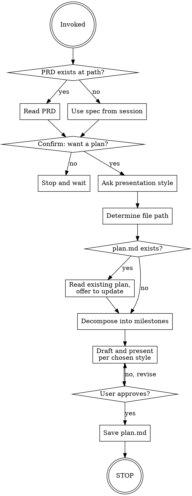

<SUBAGENT-STOP>
If you were dispatched as a subagent to execute a specific task, skip this skill.
</SUBAGENT-STOP>

This skill turns an approved spec or PRD into a sequenced milestone plan. It covers decomposition, drafting, and saving `plan.md`. It does not touch implementation.

Session boundaries are intentional, not ceremony. Each milestone runs in a fresh session so it gets a clean context window — a session that starts mid-planning carries planning-phase assumptions that can muddle implementation decisions. The plan file contains an execution prompt for each milestone; the user pastes it into a new session when they're ready to execute.

<HARD-GATE>
Do NOT produce a plan without explicit user confirmation. Do NOT start implementation. Do NOT chain into execution after saving plan.md. This skill ends when the plan is saved and approved, or when the user declines. No exceptions.
</HARD-GATE>

## Checklist

You MUST create a task for each of these items and complete them in order:

1. **Read source material** — PRD at `docs/features/<feature-name>/prd.md` if it exists; otherwise the brainstorming spec from the current session
2. **Confirm intent** — get explicit yes before drafting anything
3. **Ask presentation style** — milestone-by-milestone or full draft
4. **Determine file path** — confirm `docs/features/<kebab-name>/plan.md`
5. **Check for existing plan.md** — read it if it exists; offer to update, never overwrite silently
6. **Decompose into milestones** — apply granularity rules; define all required fields for each milestone
7. **Draft and present per chosen style** — wait for approval before saving
8. **Save plan.md then STOP** — do not chain into execution; the user starts each milestone in a fresh session

## Process Flow



## The Process

### Step 1: Read source material

Look for `docs/features/<feature-name>/prd.md`. If it exists, read it — this is the primary input for decomposition. If not, use the brainstorming spec from the current session. If neither is available, ask the user to describe the feature goal before continuing.

### Step 2: Confirm intent

Even when invoked explicitly, confirm before producing anything:

> "I can create a milestone implementation plan for this. Want me to proceed?"

If no, stop and wait. If yes, continue.

### Step 3: Ask presentation style

> "How would you like to review the plan — milestone by milestone so we can refine each one, or as a complete first draft you review all at once?"

Hold the answer — it determines how Step 7 runs.

### Step 4: Determine file path

Default path: `docs/features/<kebab-name>/plan.md`

If the feature name isn't obvious from context, ask:

> "What should I call this feature? I'll save the plan to `docs/features/<name>/plan.md`."

Confirm the path before writing.

### Step 5: Check for existing plan.md

Check whether a file already exists at the determined path. If it does:

1. Read it
2. Briefly summarize what milestones it already contains
3. Ask: "A plan already exists here. Want me to update it with new milestones, or start fresh?"

Never overwrite silently.

### Step 6: Decompose into milestones

Break the work into milestones using the rules in **Milestone Granularity** below. For each milestone, define:

- **Name** — short and descriptive
- **Goal** — what this milestone achieves
- **Files affected** — list of expected files to change
- **Dependencies** — plain language: "None" or "Requires Milestone N to be complete (reason)"
- **Completion checklist** — the standard four items (see **plan.md Structure**)
- **Execution prompt** — generated from **Execution Prompt Template**

### Step 7: Draft and present per chosen style

- **Milestone-by-milestone:** Present each milestone and wait for thumbs-up before continuing. Revise and re-present if the user wants changes.
- **Full draft:** Present the complete plan in one block. Wait for overall approval before saving.

### Step 8: Save plan.md then STOP

Write the approved plan to the file path from Step 4. Always save to the repo — never leave plan.md as conversation-only output.

Then stop. Do not offer to begin execution. Do not suggest starting milestone 1. The user will open a new session and paste the execution prompt from plan.md when they're ready.

---

## plan.md Structure

The approved plan file must follow this layout exactly. Execution sessions depend on consistent field names and formatting.

**Header block:**

```
# Implementation Plan: Feature Name

**Source:** docs/features/feature-name/prd.md  (or "brainstorming spec only")
**Created:** YYYY-MM-DD

## Overview
1-2 sentence summary of the plan approach.

## Milestones
```

**Each milestone block (repeat for each milestone, separated by `---`):**

```
### Milestone N: Short name
**Goal:** What this milestone achieves.
**Files affected:** list of expected files
**Dependencies:** None (or "Requires Milestone N to be complete — reason")

**Completion checklist:**
- [ ] Tests written and passing
- [ ] Code review requested and addressed
- [ ] All acceptance criteria for this milestone met
- [ ] Plan file updated with completion notes

**Execution prompt:**
[fenced code block containing the generated execution prompt — see Execution Prompt Template]

**Completion notes:** *(filled in after execution)*
**Suggested commit message:** *(filled in after execution)*
```

Completion notes and suggested commit message are left blank in the plan — the execution session fills them in after the milestone is complete.

---

## Execution Prompt Template

Every milestone gets an execution prompt generated from this template. Substitute milestone number, milestone name, and feature name. All other text is fixed.

```
You are executing Milestone N of the feature-name feature in mysuperpowers. The plan was created and approved in a previous session. Do NOT brainstorm. Do NOT create a PRD. Do NOT create a new plan.

## Milestone N: name

Read the following for context:
- Plan: docs/features/feature-name/plan.md (find Milestone N)
- PRD (if it exists): docs/features/feature-name/prd.md

## Before starting
Verify in plan.md that prior milestones' completion checklists are fully checked. If a dependency milestone is incomplete, stop and tell me — do not proceed.

## Execution rules
- Use the standard mysuperpowers execution workflow: test-driven-development, requesting-code-review, verification-before-completion as appropriate
- Work on the current branch unless I tell you otherwise — do not create a git worktree
- Do NOT commit changes. After completing the milestone, provide a suggested commit message I can use to commit manually
- Do NOT start the next milestone — each milestone runs in its own session by design

## When complete
1. Update Milestone N's completion checklist in docs/features/feature-name/plan.md (check all four boxes)

   Note on the completion checklist: Complete every item that applies to this milestone honestly. If an item doesn't cleanly apply to this milestone's scope (for example, a foundation milestone may have no meaningful application code to test, a deployment config milestone may have no reviewable business logic), mark it complete with a brief annotation like "✓ N/A — [reason]". Do not invent meaningless work just to check a box. Do not leave items unchecked without explanation.

2. Add a brief completion note to plan.md (1-2 lines: what was done, any deviations from the plan)
3. Provide a suggested commit message in the format: "Milestone N: name — brief description"
4. STOP. Do not commit. Do not start the next milestone. Wait for me.
```

---

## Milestone Granularity

A milestone is a logically coherent unit of work — a set of changes that belong together because they accomplish one focused goal. Use these self-checks when decomposing:

- **Coherence over size.** A milestone touching many files is fine if the changes belong together. Touching few files is not automatically good if they're unrelated.
- **Human-PR-reviewable.** If reviewing the milestone's changes in one sitting would feel exhausting or confusing, it's too big or too unfocused.
- **Trivial changes are steps, not milestones.** A one-line fix or config tweak belongs inside a larger milestone, not as its own.
- **No hard caps.** There are no hard limits on lines, files, or criteria. Use judgment.
- **When in doubt, prefer coherent and slightly larger** over fragmented and small.

---

## Hard Rules

1. Never start implementation from this skill
2. Never produce a plan without explicit user confirmation
3. Never overwrite an existing plan.md silently — read first, offer to update
4. Never commit on behalf of the user (the execution prompt also enforces this during execution)
5. Never renumber milestones after the plan is created — insertions go at the end as new milestones with the next available number
6. Always save plan.md to the repo — never leave as conversation-only output
7. After plan.md is saved, STOP — do not chain into execution

If the user asks to begin implementation during or after planning, politely decline and explain: each milestone runs in its own fresh session by design. The plan file contains an execution prompt they can paste into a new session to begin.

---

## Red Flags

| Thought | Reality |
|---|---|
| "The plan is approved, I'll just start milestone 1 to be helpful" | NO. Planning ends in this session by design. Each milestone runs in a fresh session for context isolation. Stop after saving. |
| "The user said this is urgent, I'll skip planning and just implement" | Only skip if the user EXPLICITLY says to skip. Don't infer urgency from tone and bypass the workflow. |
| "Milestone 1 is small, I might as well chain into milestone 2" | NO. Even small milestones run in their own session. Session boundaries are intentional, not overhead. |
| "I'll batch tiny milestones together to save sessions" | NO. The point of fresh sessions is clean context, not session count. Don't compress. |
| "I should renumber milestones for clarity after inserting one" | NO. Renumbering invalidates execution sessions already in flight. Insertions go at the end. |
