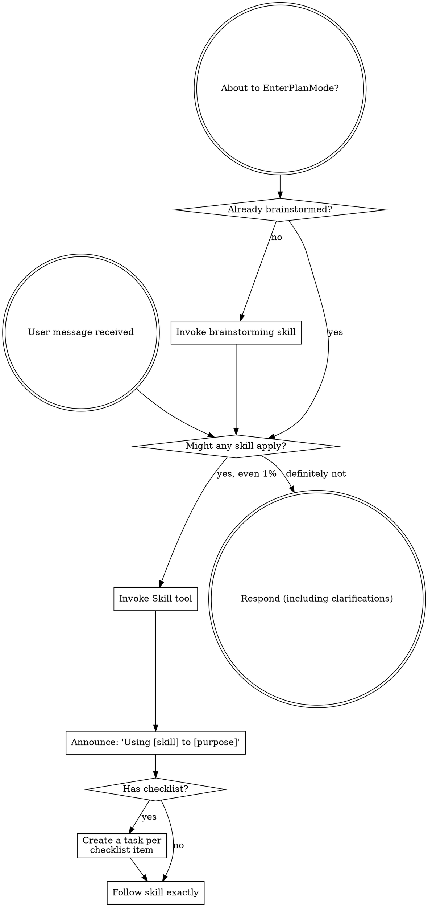

<SUBAGENT-STOP>
If you were dispatched as a subagent to execute a specific task, skip this skill.
</SUBAGENT-STOP>

<EXTREMELY-IMPORTANT>
If you think there is even a 1% chance a skill might apply to what you are doing, you ABSOLUTELY MUST invoke the skill.

IF A SKILL APPLIES TO YOUR TASK, YOU DO NOT HAVE A CHOICE. YOU MUST USE IT.

This is not negotiable. This is not optional. You cannot rationalize your way out of this.
</EXTREMELY-IMPORTANT>

## Instruction Priority

1. **User's explicit instructions** (CLAUDE.md, GEMINI.md, AGENTS.md, direct requests) — highest
2. **mysuperpowers skills** — override default system behavior where they conflict
3. **Default system prompt** — lowest

If the user's instructions and a skill conflict, follow the user. The user is in control.

## How to Access Skills

**Claude Code:** the `Skill` tool. When invoked, a skill's content is loaded — follow it directly. Never use the Read tool on skill files. **Copilot CLI** (`skill` tool) and **Gemini CLI** (`activate_skill`) work the same way.

Skills use Claude Code tool names. Non-CC platforms: tool equivalents are in `references/copilot-tools.md` and `references/codex-tools.md`; Gemini CLI gets its mapping via GEMINI.md.

# Using Skills

## The Rule

**Invoke relevant or requested skills BEFORE any response or action.** Even a 1% chance a skill might apply means you invoke it to check. If an invoked skill turns out to be wrong for the situation, you don't need to use it.

## Red Flags

These thoughts mean STOP—you're rationalizing:

| Thought | Reality |
|---------|---------|
| "This is just a simple question / doesn't count as a task" | Questions and actions are tasks. Check for skills. |
| "I need more context / let me explore or gather info first" | Skill check comes BEFORE clarifying questions. Skills tell you HOW to explore and gather. |
| "This doesn't need a formal skill / the skill is overkill" | If a skill exists, use it. Simple things become complex. |
| "I remember this skill" | Skills evolve. Read the current version. |
| "I'll just do this one thing first" | Check BEFORE doing anything. |
| "I know what that means" | Knowing the concept ≠ using the skill. Invoke it. |
| "The plan is approved, I should just start milestone 1 to be helpful" | NO. Planning ends this session by design. Milestones execute in fresh sessions so each gets a clean context window. Stop after planning. |
| "The user said this is urgent, I'll skip the PRD and plan and just implement" | Only skip the planning flow if the user EXPLICITLY says to skip it. Don't infer urgency from tone. Ask if unsure. |

## Skill Priority

When multiple skills could apply:

1. **Process skills first** (brainstorming, debugging) - these determine HOW to approach the task
2. **Implementation skills second** - these guide execution

"Let's build X" → brainstorming first. "Fix this bug" → debugging first.

## Two-Phase Workflow

Development runs in two phases that never share a session:

- **Planning (single session):** `brainstorming` → optional `creating-prd` → optional `milestone-planning`. When the plan is saved — **STOP. Do not begin implementation.**
- **Execution (one fresh session per milestone):** the user pastes a milestone execution prompt from plan.md; `executing-from-plan` routes it, and the execution skills (`test-driven-development`, `systematic-debugging`, code review, verification) take over. When the milestone completes — **STOP. Do not chain into the next.**

## Hard Rules

- **Skills are mandatory.** When a skill exists and matches the task, invoke it. No exceptions.
- **Stop after planning.** After `milestone-planning` completes, stop. Do not begin implementation in the same session.
- **Work on the current branch.** Do not create git worktrees unless the user explicitly asks.
- **One milestone per session.** Each milestone is a fresh session. Do not chain milestones automatically.
- **Small tasks skip the planning flow entirely.** Typos, one-line fixes, and trivial changes go straight to execution.
- **Conversational queries do not activate skills.** Questions, explanations, and non-coding requests proceed without skill invocation.

## Skill Types

**Rigid** (TDD, debugging): Follow exactly. Don't adapt away discipline.

**Flexible** (patterns): Adapt principles to context.

The skill itself tells you which.

## User Instructions

Instructions say WHAT, not HOW. "Add X" or "Fix Y" doesn't mean skip workflows.
